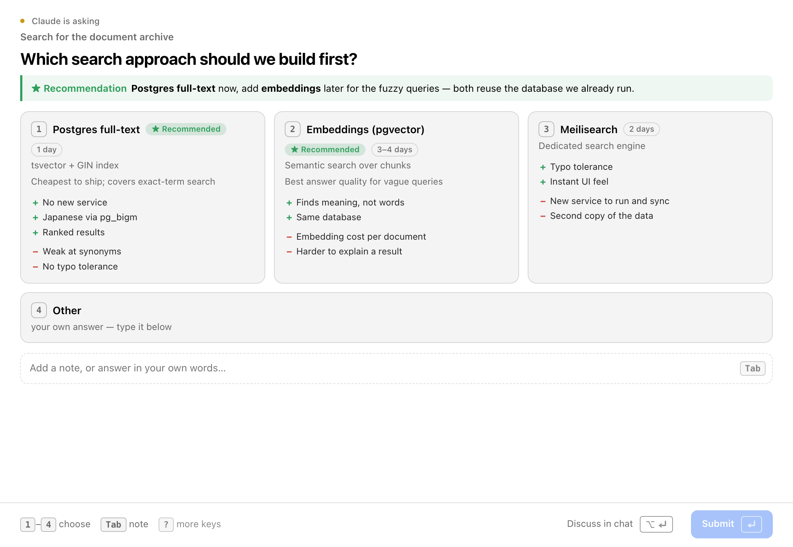

# herdr-huddle

**English** · [Русский](README_RU.md)

A [herdr](https://herdr.dev) plugin that lets a coding agent ask you a question as a rich page instead of a
plain terminal prompt. The page opens in [terminal-browser](https://github.com/zenbu-labs/terminal-browser)
zoomed over the agent's own pane; the answer comes back to the agent as JSON on stdout.



Options with subtitles, recommendations, pros and cons; previews (diagrams, charts, layouts, colors);
sliders with a live preview for taste values; several questions on one page with a summary; a free-text
note under every question. Everything works from the keyboard.

## Requirements

- herdr 0.9.0 or newer, macOS or Linux
- `terminal-browser` in `PATH`
- Python 3 (standard library only)
- `jq` for the install snippet below

## Install

```bash
herdr plugin install ivolkoff/herdr-huddle
```

The plugin registers one pane entrypoint, `page`. The CLI that agents call lives in the plugin checkout:

```bash
HUDDLE="$(herdr plugin list --json --plugin ivolkoff.huddle | jq -r '.result.plugins[0].plugin_root')"
"$HUDDLE/bin/huddle" q "Ship it today?" "*Yes|tests are green" "No|wait for review"
```

### As an agent skill

`SKILL.md` in the repository root teaches an agent the spec format and when to use huddle. For Claude Code,
link the plugin checkout as a skill:

```bash
ln -s "$HUDDLE" ~/.claude/skills/huddle
```

The skill calls `~/.claude/skills/huddle/bin/huddle`. Other agents: point them at `SKILL.md` and use the
`bin/huddle` path next to it.

## Usage

```bash
huddle q "Where should sessions live?" "*Redis|already runs the job queue" "Postgres table|one table, expiry index"
huddle spec.json            # full JSON spec, or `huddle - < spec.json`
huddle templates            # starting points in templates/
huddle demo [NAME]          # open a bundled demo
huddle render spec.json -o page.html   # build the page without showing it
```

Answer:

```json
{"status": "answered", "answers": {"answer": {"selected": ["o1"], "labels": ["Redis"], "text": "prod only"}}}
```

Exit codes: `0` answered (or `status: "chat"` when the user wants to discuss in the terminal), `2` closed
without an answer, `3` nowhere to show the page, `4` timed out, `1` error.

Outside herdr, or with `--browser`, the page opens in the default browser. The spec reference (blocks,
layouts, controls, styles) is in `SKILL.md`; templates and demos show complete specs.

## Configuration

- `~/.config/huddle/defaults.json` (or `HUDDLE_CONFIG`): personal defaults, e.g. `{"style": "minimal", "review": "always"}`.
- `PIXEL_DISPLAY_SCALE`: display scale for the page. Defaults to `1`; terminal-browser otherwise takes the
  scale of the screen under the cursor, which flips between 1x and 2x on mixed-DPI setups.
- `HUDDLE_NO_BROWSER=1`: outside herdr, exit with code 3 instead of opening a browser.

Mermaid is downloaded once to `~/.cache/huddle/`; without network, diagrams show their source.

## Credits

The page runtime, templates and demos come from huddle in
[skkap/claude-skills](https://github.com/skkap/claude-skills) (MIT). This repository replaces its transport
with a herdr plugin pane. MIT, see [LICENSE](LICENSE).
